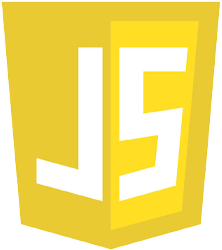
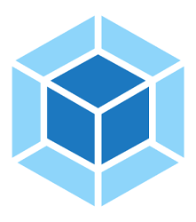

## 👋 Привет! Меня зовут Наташа и я начинающий вэб-разработчик
- 👨🏻‍🎓 заканчиваю курс обучения по профессии [Веб-разработчик](https://practicum.yandex.ru/web-plus/) Yandex.Practicum
- 👨🏻‍🍼 Помогаю студентам Yandex.Practicum как старший студент
- 📫 Связаться со мной можно:  

    
    
    
## 👋 Hi there 

My name is Natasha, and I'm a beginner frontend developer.

- 👨🏻‍🎓 Yandex.Practicum [student](https://practicum.yandex.ru/web-plus/) 
- 👨🏻‍🍼 Help junior students of Yandex.Practicum as a senior student
- 📫 How to reach me:  

    
    
    

### ⚡ Используемый стэк технологий / Technologies

 

 
  

### ⚡ Мои проекты / My projects:

- 

- 
- 
- Совместный проет студентов Yandex.Practicum:  / Colaboration project Yandex.Practicum student's: 

### ⚡ Статистика Codewars / Codewars statistic:

<!--
**NatashaSolntseva/NatashaSolntseva** is a ✨ _special_ ✨ repository because its `README.md` (this file) appears on your GitHub profile.

Here are some ideas to get you started:

- 🔭 I’m currently working on ...
- 🌱 I’m currently learning ...
- 👯 I’m looking to collaborate on ...
- 🤔 I’m looking for help with ...
- 💬 Ask me about ...
- 📫 How to reach me: ...
- 😄 Pronouns: ...
- ⚡ Fun fact: ...
-->
